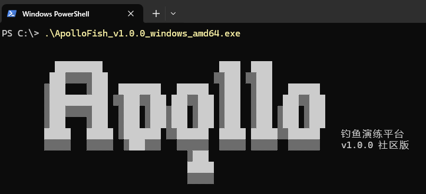
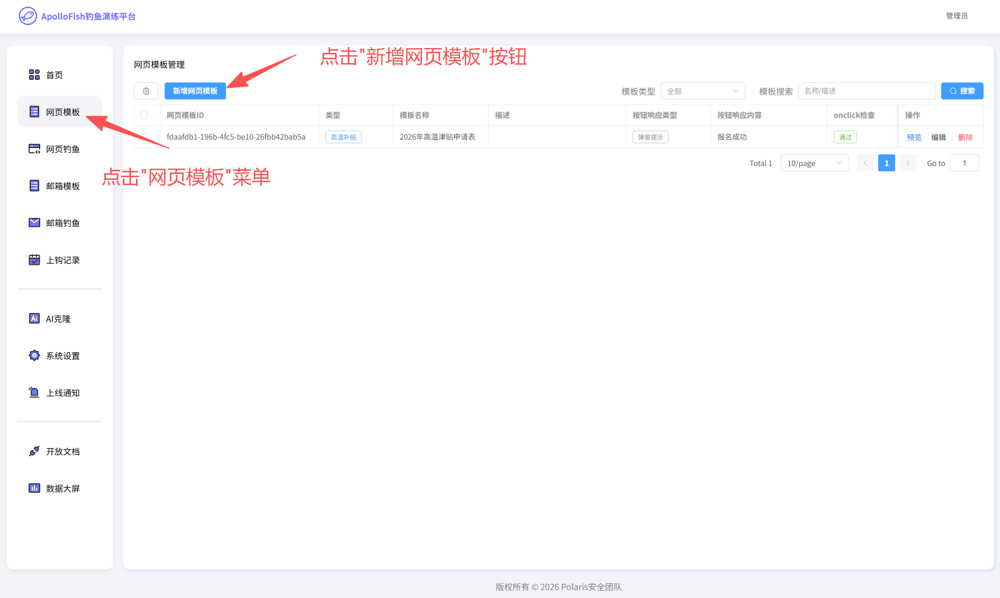
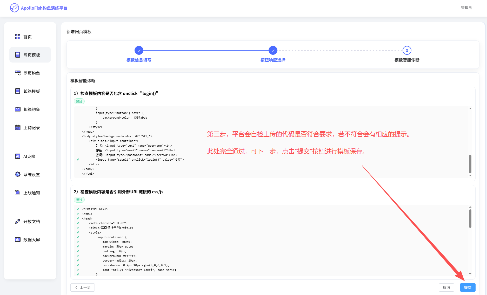
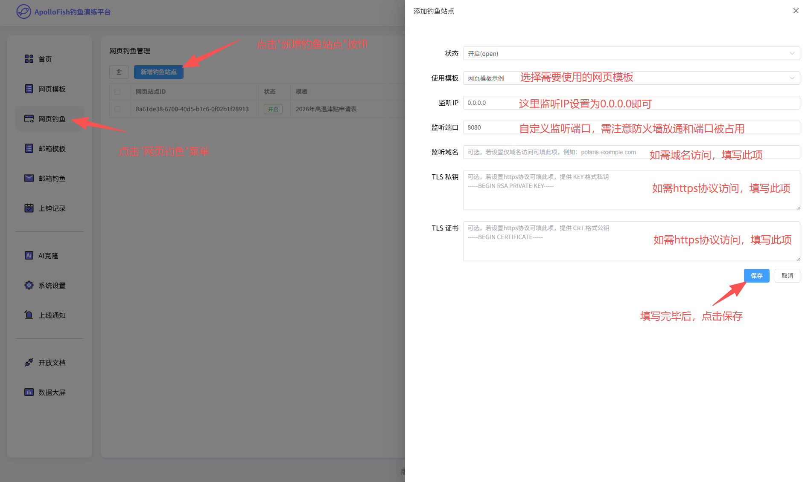
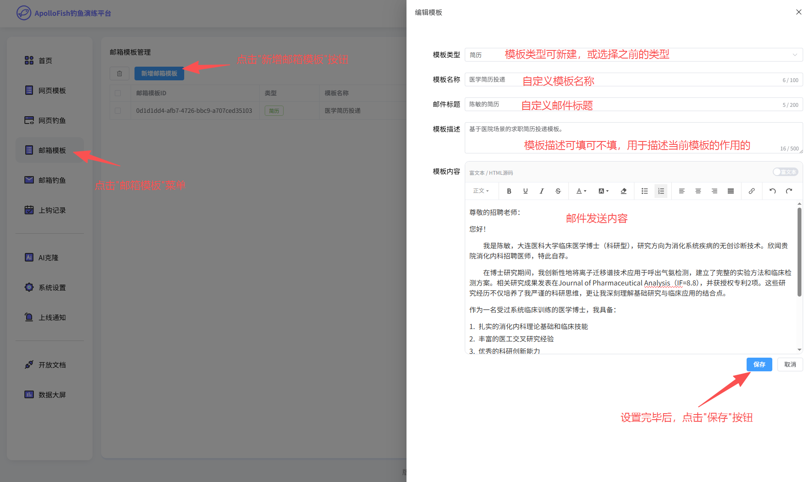
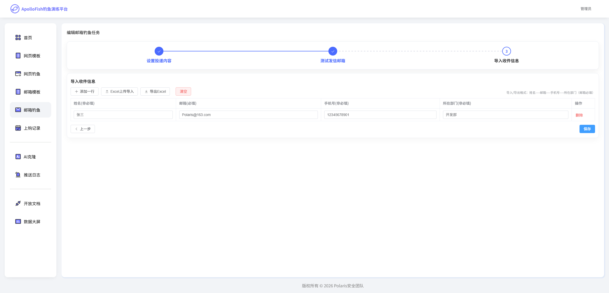
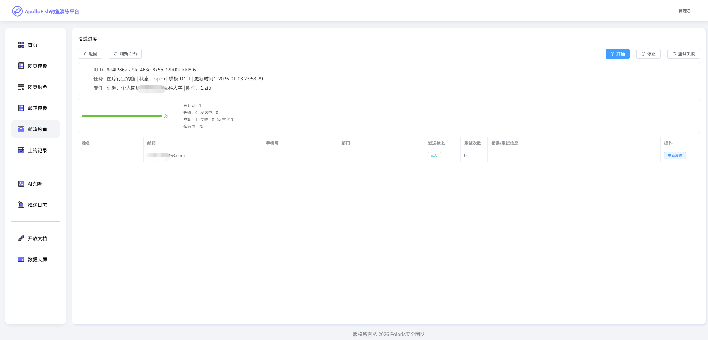

# ApolloFish-阿波罗钓鱼演练平台

## 平台介绍

### 背景

在数字化浪潮下，钓鱼攻击已成为企业网络安全的主要威胁之一。仿冒网页、恶意邮件等钓鱼手段层出不穷，一旦员工不慎中招，可能导致企业核心数据泄露、系统瘫痪、财产损失等严重后果。在此背景下，阿波罗钓鱼演练平台(ApolloFish)应运而生，平台以“实战演练赋能安全意识提升”为核心目标，通过模拟真实的网页钓鱼、邮箱钓鱼场景，帮助企业精准检验员工安全防护能力，系统性强化全员安全意识，筑牢企业网络安全第一道防线。

### 平台价值

为企业安全意识提升赋能

1. 实战化演练，贴近真实攻击场景：摒弃传统说教式安全培训的弊端，以1:1还原真实钓鱼攻击的演练模式，让员工在沉浸式体验中直观感受钓鱼攻击的隐蔽性和危害性，深刻认识到安全防护的重要性。

2. 精准化评估，定位安全防护短板：通过全流程行为数据追踪和多维度分析，生成企业全员安全意识评估报告，清晰呈现各部门、各层级员工的安全防护能力差异，为企业制定针对性的安全培训计划提供数据支撑。

3. 个性化培训，提升培训实效：基于演练结果精准推送个性化培训内容，实现“因材施教”，让员工快速掌握与自身岗位相关的钓鱼攻击识别技巧，提升培训的针对性和实效性。

4. 全流程管控，简化演练管理难度：平台提供从演练场景配置、演练发起、过程监控到报告生成、培训跟进的全流程可视化管理功能，操作简单便捷，无需专业的安全技术团队即可完成演练组织，大幅降低企业安全演练的管理成本和技术门槛。

### 适用场景

本平台适用于各类规模的企业、事业单位、政府机构等组织，可广泛应用于员工安全意识常态化培训、新员工入职安全培训、重大节假日前后安全防护强化、企业网络安全专项整治等场景，助力组织构建全员参与、全程防控的安全意识体系。

## 使用说明

### 部署方式
> 阿波罗钓鱼演练平台 优势：
- [*] 无需Docker环境
- [*] 无需复杂的依赖环境
- [*] 支持跨平台运行

下载地址：https://github.com/safe1024/apollofish/releases <br>
阿波罗钓鱼演练平台支持多系统运行，支持x86架构和arm架构。<br>
若您是Windows，且CPU是Intel、AMD，请下载：ApolloFish_windows_amd64.exe<br>
若您是Windows，且CPU是骁龙、联发科，请下载：ApolloFish_windows_arm.exe<br>

若您是Macbook/Mac mini/Mac Studio，且CPU是Intel，请下载：ApolloFish_mac_amd64.exe<br>
若您是Macbook/Mac mini/Mac Studio，且CPU是M系列，请下载：ApolloFish_mac_arm.exe<br>

若您是Linux或基于Linux内核的国产信创系统，且CPU是Intel、AMD、海光系列，请下载：ApolloFish_linux_amd64.exe<br>
若您是Linux或基于Linux内核的国产信创系统，且CPU是鲲鹏系列，请下载：ApolloFish_linux_arm.exe<br>

### 运行命令
命令行执行，例如: 
> ./ApolloFish_v1.0.0_windows_amd64.exe
<br>


<br>
首次运行，会在同目录下生成config.yaml文件，并随机生成后台路径、登录账号、登录密码。请前往config.yaml文件中查看。<br>

```
panel:
    path: 76cd36b08d6a11c2237f7be87075ce43
    port: 3333
    username: 9bqz38hz
    password: ky9je64t
```
使用浏览器访问平台后台，访问路径: http://127.0.0.1:{panel.port}/{panel.path}/<br>

## 功能说明


### 首页大屏


### 网页模板

平台内置了一些常见的钓鱼演练模板，您可以直接选择使用。也可以在此创建您自己的钓鱼模板。

#### 模板制作
自己制作网页模板时，尽量确保: <br>
1、避免使用外部的js/css资源(防止外部链接资源无法访问的情况下，可能影响到钓鱼页面显示和功能)<br>
2、避免上传js代码(例如自己写了登录逻辑，可能影响到数据上报)<br>

建议使用纯HTML + 内嵌CSS 样式作为模板内容。<br>
例如:

```
<!DOCTYPE html>
<html>
<head>
    <meta charset="UTF-8">
    <title>网页模板示例</title>
    <style>
        .input-container {
            max-width: 400px;
            margin: 50px auto;
            padding: 30px;
            background: #ffffff;
            border-radius: 10px;
            box-shadow: 0 2px 10px rgba(0,0,0,0.1);
            font-family: "Microsoft YaHei", sans-serif;
        }
        input {
            width: 100%;
            padding: 12px;
            margin: 8px 0 16px 0;
            border: 1px solid #e0e0e0;
            border-radius: 6px;
            box-sizing: border-box;
            font-size: 14px;
        }
        input:focus {
            outline: none;
            border-color: #4a90e2;
            box-shadow: 0 0 5px rgba(74,144,226,0.3);
        }
        input[type="button"] {
            background-color: #4a90e2;
            color: white;
            border: none;
            cursor: pointer;
            font-weight: bold;
            transition: background-color 0.3s;
        }
        input[type="button"]:hover {
            background-color: #357abd;
        }
    </style>
</head>
<body style="background-color: #f5f5f5;">
    <div class="input-container">
        姓名：<input type="text" name="username"><br>
        邮箱：<input type="email" name="useremail"><br>
        密码：<input type="password" name="userpwd"><br>
        <button type="button">提交</button>
    </div>
</body>
</html>
```
此例子中，只需要在 ```<button type="button">提交</button>``` 添加属性 ```onclick="login()"``` 即可。<br>
添加后的body代码:
```
    <div class="input-container">
        姓名：<input type="text" name="username"><br>
        邮箱：<input type="email" name="useremail"><br>
        密码：<input type="password" name="userpwd"><br>
        <button type="button" onclick="login()">提交</button>
    </div>
```
平台会自动识别input组件，并将当前页面中所有的input的参数都进行记录。所以拓展性非常自由，input中的name值可以自定义、input组件的数量也可多可少。

网页模板创建方式：




已经创建成功，可点击预览查看效果。


这个预览功能仅管理员可见，用于预览你的HTML页面。如需创建到互联网，请点击左侧菜单中的"网页钓鱼"按钮，并参考下面的使用手册。

### 网页钓鱼
此功能是让现有的网页模板创建站点，进行对外访问使用。<br>
> 支持自定义端口号(需注意主机防火墙是否放通、云厂商防火墙是否放通)<br>
> 支持IP访问或域名访问<br>
> 支持配置https证书，实现加密访问<br>




### 邮箱模板
平台内置了一些常见的钓鱼演练模板，您可以直接选择使用。也可以在此创建您自己的钓鱼模板，创建方法如下：


### 邮箱钓鱼


邮件附件可选择如上添加的模板。

输入任务标题、附件内容等，添加附件信息。


设置邮件发送者的邮箱。点击SMTP测试可验证邮件是否填写成功。




输入对目标接受者信息导入。



点击详情可查看发送状态，和选择重新发送。

### 上钩记录

#### 网页钓鱼记录


点击上钩记录，可查看到用户输入的信息。


点击详情可查看到用户详细输入的具体信息通过JSON形式存储。

#### 邮箱钓鱼记录

(下版本发布)

### AI生成克隆(下版本发布)

### 系统设置(下版本发布)

### 上线通知(下版本发布)


## 技术交流群


